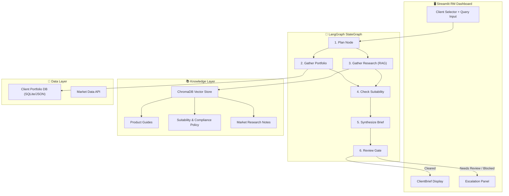
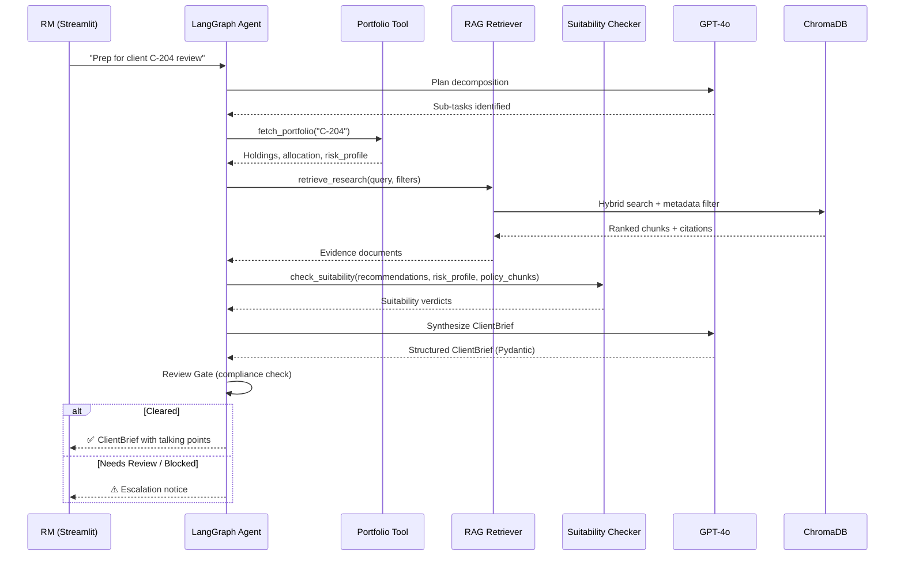
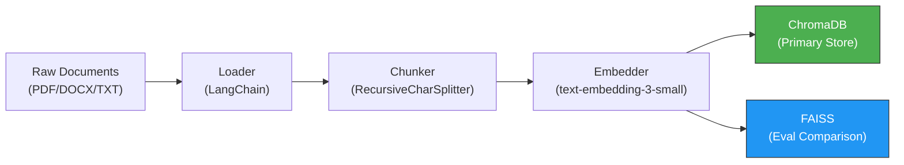
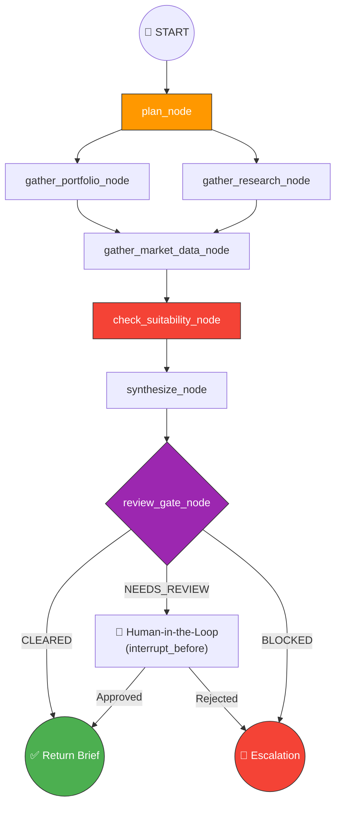
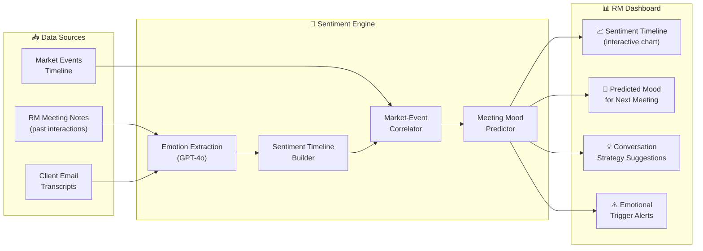

# Relationship Manager Copilot for Wealth Management — Implementation Plan

> **Project 6 — Capstone** | Stack: Python · LangGraph · OpenAI · ChromaDB/FAISS · Streamlit
> Source: [Capstone-P6-Relationship-Manager-WealthMgmt-LangGraph.md](file:///i:/git_repo/WealthManagerCopilot/Viraj%20Draft/Capstone-P6-Relationship-Manager-WealthMgmt-LangGraph.md)

---

## Table of Contents

1. [Executive Summary](#1-executive-summary)
2. [System Architecture](#2-system-architecture)
3. [Project Structure & File Layout](#3-project-structure--file-layout)
4. [Data Models (Pydantic)](#4-data-models-pydantic)
5. [Knowledge Ingestion Pipeline](#5-knowledge-ingestion-pipeline)
6. [Tool Implementations](#6-tool-implementations)
7. [LangGraph Agentic Pipeline](#7-langgraph-agentic-pipeline)
8. [RAG — Retrieval-Augmented Generation](#8-rag--retrieval-augmented-generation)
9. [Safety, Guardrails & Compliance](#9-safety-guardrails--compliance)
10. [Frontend — Streamlit RM Dashboard](#10-frontend--streamlit-rm-dashboard)
11. [Evaluation & Analytics (Part B)](#11-evaluation--analytics-part-b)
12. [DevOps, Configuration & Environment](#12-devops-configuration--environment)
13. [Sample Data Requirements](#13-sample-data-requirements)
14. [Verification Plan](#14-verification-plan)
15. [Implementation Timeline](#15-implementation-timeline)
16. [🚀 Enhancement Plan — Client Sentiment Time-Machine](#16--enhancement-plan--client-sentiment-time-machine)

---

## 1. Executive Summary

### Problem
Relationship Managers (RMs) in wealth management spend hours manually pulling client data, cross-referencing compliance policies, and drafting talking-point briefs before every client meeting. This process is error-prone, slow, and creates compliance risk.

### Solution
Build a **multi-tool agentic assistant** that automates the entire meeting-prep workflow:
1. Fetches a client's portfolio & risk profile
2. Retrieves relevant market research, product info, and compliance policies via RAG
3. Validates every recommendation against suitability & compliance constraints
4. Produces a structured, citation-backed `ClientBrief` with talking points
5. Escalates anything requiring licensed advice to human reviewers

### Key Technology Decisions

| Decision | Choice | Rationale |
|---|---|---|
| **LLM** | GPT-4o / GPT-4.1 | Best reasoning + function-calling support |
| **Embeddings** | `text-embedding-3-small` | Cost-effective, high-quality embeddings |
| **Vector Store** | ChromaDB (primary) + FAISS (evaluation) | ChromaDB for metadata filtering; FAISS for speed comparison |
| **Orchestration** | LangGraph `StateGraph` | Explicit control flow, conditional edges, human-in-the-loop |
| **Structured Output** | Pydantic v2 | Strict validation, serialization, schema enforcement |
| **Frontend** | Streamlit | Rapid RM dashboard prototyping |
| **Tracing** | LangSmith | Full observability of agent runs |

---

## 2. System Architecture

### High-Level Flow



### Component Interaction Detail



---

## 3. Project Structure & File Layout

```
WealthManagerCopilot/
├── README.md
├── requirements.txt
├── .env.example                          # API keys template
├── .env                                  # Local API keys (gitignored)
├── pyproject.toml                        # Project metadata
│
├── config/
│   └── settings.py                       # Centralized config (env vars, model params)
│
├── data/
│   ├── raw/                              # Source documents (PDFs, DOCX, TXT)
│   │   ├── product_guides/               # ≥ 3 product guide documents
│   │   ├── compliance_policies/          # ≥ 3 suitability/compliance docs
│   │   └── research_notes/               # ≥ 4 market research documents
│   ├── clients/
│   │   └── clients.json                  # Client portfolio database
│   └── golden_set/
│       └── evaluation_queries.json       # Golden test queries + expected answers
│
├── src/
│   ├── __init__.py
│   │
│   ├── models/                           # Pydantic data models
│   │   ├── __init__.py
│   │   ├── client.py                     # ClientProfile, PortfolioHolding
│   │   ├── brief.py                      # ClientBrief, Recommendation, SuitabilityResult
│   │   └── documents.py                  # DocumentChunk, VectorMetadata
│   │
│   ├── ingestion/                        # Knowledge ingestion pipeline
│   │   ├── __init__.py
│   │   ├── loader.py                     # Multi-format document loaders
│   │   ├── chunker.py                    # Structure-aware chunking
│   │   ├── embedder.py                   # OpenAI embedding wrapper
│   │   └── indexer.py                    # ChromaDB/FAISS indexing
│   │
│   ├── tools/                            # Agent tools
│   │   ├── __init__.py
│   │   ├── portfolio_tool.py             # Client portfolio lookup
│   │   ├── market_data_tool.py           # Market data retrieval
│   │   ├── rag_retriever_tool.py         # Hybrid RAG with metadata filtering
│   │   └── suitability_checker_tool.py   # Compliance & suitability validation
│   │
│   ├── agent/                            # LangGraph agent
│   │   ├── __init__.py
│   │   ├── state.py                      # Agent state schema
│   │   ├── nodes.py                      # Graph node functions
│   │   ├── graph.py                      # StateGraph assembly
│   │   └── prompts.py                    # System & node prompts
│   │
│   ├── guardrails/                       # Safety & compliance
│   │   ├── __init__.py
│   │   ├── compliance_gate.py            # Pre-output compliance checks
│   │   ├── entitlement_filter.py         # Sensitivity-based access control
│   │   └── disclaimers.py                # Standard disclaimers
│   │
│   └── utils/                            # Shared utilities
│       ├── __init__.py
│       ├── logging.py                    # Structured logging + audit trail
│       └── tracing.py                    # LangSmith integration
│
├── app/
│   ├── streamlit_app.py                  # Main Streamlit dashboard
│   └── components/                       # Streamlit UI components
│       ├── client_selector.py
│       ├── brief_renderer.py
│       └── escalation_view.py
│
├── notebooks/
│   ├── 01_ingestion_demo.ipynb           # Ingestion pipeline walkthrough
│   ├── 02_agent_playground.ipynb         # Interactive agent testing
│   └── 03_evaluation.ipynb              # Evaluation metrics notebook
│
└── tests/
    ├── test_models.py
    ├── test_ingestion.py
    ├── test_tools.py
    ├── test_agent.py
    └── test_guardrails.py
```

---

## 4. Data Models (Pydantic)

### 4.1 Core Enums & Types

```python
# src/models/client.py
from enum import Enum
from pydantic import BaseModel, Field
from typing import Optional
from datetime import date

class RiskProfile(str, Enum):
    CONSERVATIVE = "conservative"
    BALANCED = "balanced"
    GROWTH = "growth"
    AGGRESSIVE = "aggressive"

class AssetClass(str, Enum):
    EQUITY = "equity"
    FIXED_INCOME = "fixed_income"
    ALTERNATIVES = "alternatives"
    CASH = "cash"
    REAL_ESTATE = "real_estate"
    COMMODITY = "commodity"

class PortfolioHolding(BaseModel):
    ticker: str = Field(..., description="Instrument ticker/ID")
    name: str = Field(..., description="Instrument display name")
    asset_class: AssetClass
    allocation_pct: float = Field(..., ge=0, le=100, description="% of portfolio")
    current_value: float = Field(..., ge=0)
    gain_loss_pct: float = Field(..., description="Unrealized P&L %")

class ClientProfile(BaseModel):
    client_id: str = Field(..., pattern=r"^C-\d{3,}$", description="e.g. C-204")
    name: str
    risk_profile: RiskProfile
    investment_horizon: str  # e.g. "5-10 years"
    total_aum: float = Field(..., ge=0, description="Assets Under Management")
    holdings: list[PortfolioHolding]
    last_review_date: Optional[date] = None
    rm_id: Optional[str] = None
    entitlement_tier: str = Field(default="standard", description="standard | premium | institutional")
```

### 4.2 ClientBrief (Structured Output)

```python
# src/models/brief.py
from enum import Enum
from pydantic import BaseModel, Field
from typing import Optional

class ComplianceStatus(str, Enum):
    CLEARED = "cleared"
    NEEDS_REVIEW = "needs_review"
    BLOCKED = "blocked"

class SuitabilityVerdict(str, Enum):
    SUITABLE = "suitable"
    MARGINAL = "marginal"
    UNSUITABLE = "unsuitable"
    REQUIRES_LICENSED_ADVICE = "requires_licensed_advice"

class Citation(BaseModel):
    doc_id: str = Field(..., description="Source document ID from vector store")
    doc_type: str = Field(..., description="product | policy | research")
    chunk_text: str = Field(..., max_length=500, description="Relevant excerpt")
    page_or_section: Optional[str] = None

class Recommendation(BaseModel):
    idea: str = Field(..., description="The recommendation/action item")
    rationale: str = Field(..., description="Why this is recommended")
    suitability: SuitabilityVerdict
    suitability_reasoning: str = Field(..., description="Suitability assessment explanation")
    citations: list[Citation] = Field(..., min_length=1, description="≥1 citation required")

class ClientBrief(BaseModel):
    client_id: str
    risk_profile: RiskProfile
    portfolio_summary: str = Field(..., description="Holdings & allocation narrative")
    portfolio_risk_assessment: str = Field(..., description="Overall portfolio risk narrative")
    recommendations: list[Recommendation] = Field(default_factory=list)
    compliance_status: ComplianceStatus
    compliance_notes: str = Field(default="", description="Compliance gate reasoning")
    talking_points: list[str] = Field(..., min_length=1, description="RM-ready discussion points")
    escalation_required: bool = Field(default=False)
    escalation_reason: Optional[str] = None
    disclaimers: list[str] = Field(
        default=["This brief is decision-support for RMs, not personalized investment advice."]
    )
    generated_at: str = Field(..., description="ISO timestamp")
    trace_id: Optional[str] = Field(None, description="LangSmith trace ID for audit")
```

### 4.3 Document / Vector Store Metadata

```python
# src/models/documents.py
from pydantic import BaseModel, Field
from typing import Optional
from datetime import date

class DocType(str, Enum):
    PRODUCT = "product"
    POLICY = "policy"
    RESEARCH = "research"

class Sensitivity(str, Enum):
    PUBLIC = "public"
    INTERNAL = "internal"
    RESTRICTED = "restricted"

class DocumentChunk(BaseModel):
    doc_id: str = Field(..., description="Unique document identifier")
    chunk_id: str = Field(..., description="Unique chunk identifier")
    doc_type: DocType
    source: str = Field(..., description="Original filename/URL")
    content: str
    date: Optional[date] = None
    sensitivity: Sensitivity = Sensitivity.INTERNAL
    metadata: dict = Field(default_factory=dict, description="Extra metadata for filtering")
```

---

## 5. Knowledge Ingestion Pipeline

### 5.1 Document Loading

#### [NEW] `src/ingestion/loader.py`

| Aspect | Detail |
|---|---|
| **Formats** | PDF (PyPDFLoader), DOCX (Docx2txtLoader), TXT (TextLoader), Markdown |
| **Library** | LangChain document loaders |
| **Minimum** | ≥ 10 source documents across 3 types (product, policy, research) |
| **Metadata Injection** | Each document gets: `doc_type`, `date`, `source`, `sensitivity` |

```python
# Loader logic pseudocode
def load_documents(data_dir: str) -> list[Document]:
    """Load all documents from raw/ subdirectories with metadata."""
    documents = []
    for subdir, doc_type in [("product_guides", "product"), 
                              ("compliance_policies", "policy"),
                              ("research_notes", "research")]:
        path = Path(data_dir) / subdir
        for file in path.iterdir():
            doc = load_file(file)  # Dispatch to correct loader by extension
            doc.metadata.update({
                "doc_type": doc_type,
                "source": file.name,
                "date": extract_date(file),  # From filename or file metadata
                "sensitivity": infer_sensitivity(doc_type, file.name)
            })
            documents.append(doc)
    return documents
```

### 5.2 Structure-Aware Chunking

#### [NEW] `src/ingestion/chunker.py`

| Parameter | Value | Rationale |
|---|---|---|
| **Chunk Size** | 800 tokens | Balances context vs. retrieval precision |
| **Chunk Overlap** | 200 tokens | Preserves cross-boundary context |
| **Separators** | `["\n## ", "\n### ", "\n\n", "\n", ". "]` | Respects document structure |
| **Strategy** | `RecursiveCharacterTextSplitter` | Structure-aware, predictable |

Key behaviors:
- Preserve section headings as chunk prefixes for context
- Attach parent document metadata to every chunk
- Generate unique `chunk_id` = `{doc_id}_{chunk_index}`
- Metadata inherits: `doc_type`, `source`, `date`, `sensitivity`

### 5.3 Embedding & Indexing

#### [NEW] `src/ingestion/embedder.py` + `src/ingestion/indexer.py`

| Aspect | Detail |
|---|---|
| **Model** | `text-embedding-3-small` (1536 dims) |
| **Batch Size** | 100 chunks per API call |
| **Vector Store** | ChromaDB with persistent storage |
| **Collection Name** | `wealth_management_knowledge` |
| **Metadata Filters** | `doc_type`, `sensitivity`, `date` |
| **FAISS Index** | Secondary index for evaluation speed comparisons |



---

## 6. Tool Implementations

### 6.1 Portfolio Lookup Tool

#### [NEW] `src/tools/portfolio_tool.py`

```python
@tool("portfolio_lookup")
def portfolio_lookup(client_id: str) -> dict:
    """
    Fetch client portfolio holdings and risk profile.
    
    Args:
        client_id: Client identifier (e.g. "C-204")
    
    Returns:
        Dict with: client_name, risk_profile, total_aum, holdings[], 
        allocation_breakdown, last_review_date
    """
```

- **Data Source**: `data/clients/clients.json` (simulated client DB)
- **Validation**: Validates `client_id` format via Pydantic
- **Error Handling**: Returns structured error if client not found
- **Access Control**: Checks RM entitlement tier before returning data

### 6.2 Market Data Tool

#### [NEW] `src/tools/market_data_tool.py`

```python
@tool("market_data")
def market_data(ticker: str, period: str = "1M") -> dict:
    """
    Retrieve market data for a given ticker/fund.
    
    Args:
        ticker: Instrument ticker (e.g. "SPY", "VBMFX")
        period: Lookback period ("1W", "1M", "3M", "6M", "1Y")
    
    Returns:
        Dict with: current_price, period_return, volatility, 
        52w_high, 52w_low, sector
    """
```

- **Data Source**: Simulated market data JSON (for reproducibility) + optional real API integration
- **Fallback**: If ticker not found in local data, returns a "data unavailable" response (no hallucination)

### 6.3 RAG Retriever Tool

#### [NEW] `src/tools/rag_retriever_tool.py`

```python
@tool("rag_retriever")
def rag_retriever(
    query: str, 
    doc_types: list[str] = None,       # Filter: ["product", "policy", "research"]
    sensitivity_max: str = "internal",   # Entitlement filter
    top_k: int = 5,
    date_after: str = None              # Freshness filter
) -> list[dict]:
    """
    Hybrid RAG retriever over the wealth management knowledge base.
    
    Returns top-k relevant chunks with metadata and citations.
    """
```

- **Search Strategy**: Semantic similarity search + metadata filtering
- **Entitlement Filtering**: Chunks with `sensitivity > user_tier` are excluded
- **Freshness**: Optional `date_after` filter for time-sensitive research
- **Output**: List of `{chunk_id, content, doc_type, source, score, citation}` dicts
- **Reranking**: Optional cross-encoder reranking for top results

### 6.4 Suitability Checker Tool

#### [NEW] `src/tools/suitability_checker_tool.py`

```python
@tool("suitability_checker")
def suitability_checker(
    recommendation: str,
    client_risk_profile: str,
    policy_context: list[str]   # Relevant policy chunks from RAG
) -> dict:
    """
    Validate a recommendation against suitability & compliance policy.
    
    Returns:
        Dict with: verdict (suitable/marginal/unsuitable/requires_licensed_advice),
        reasoning, policy_citations, requires_escalation
    """
```

- **Logic**: Uses LLM-guided suitability assessment with policy chunks as grounding
- **Rule-Based Checks**: Hard-coded rules for obvious violations (e.g., recommending aggressive products to conservative clients)
- **Escalation Trigger**: If recommendation constitutes "personalized investment advice" → `requires_licensed_advice`
- **Citation Requirement**: Every verdict must cite specific policy chunks

---

## 7. LangGraph Agentic Pipeline

### 7.1 Agent State Schema

#### [NEW] `src/agent/state.py`

```python
from typing import TypedDict, Annotated
from langgraph.graph.message import add_messages

class AgentState(TypedDict):
    # Input
    messages: Annotated[list, add_messages]
    client_id: str
    rm_id: str
    rm_entitlement_tier: str
    
    # Planning
    plan: list[str]             # Decomposed sub-tasks
    current_step: int
    
    # Gathered evidence
    portfolio: dict | None
    research_chunks: list[dict]
    market_data: list[dict]
    
    # Suitability
    suitability_results: list[dict]
    
    # Output
    draft_brief: dict | None
    final_brief: dict | None      # Validated ClientBrief
    
    # Control flow
    compliance_status: str        # "cleared" | "needs_review" | "blocked"
    escalation_required: bool
    escalation_reason: str | None
    step_count: int               # Bounded loop counter
    max_steps: int                # Default: 10
    error: str | None
```

### 7.2 Graph Nodes

#### [NEW] `src/agent/nodes.py`

| Node | Purpose | Tool Calls | Output to State |
|---|---|---|---|
| `plan_node` | Decompose RM query into sub-tasks | None (LLM only) | `plan`, `current_step` |
| `gather_portfolio_node` | Fetch client holdings + risk profile | `portfolio_lookup` | `portfolio` |
| `gather_research_node` | RAG retrieval over knowledge base | `rag_retriever` | `research_chunks` |
| `gather_market_data_node` | Get market data for relevant tickers | `market_data` | `market_data` |
| `check_suitability_node` | Validate draft recommendations | `suitability_checker` | `suitability_results` |
| `synthesize_node` | Produce structured ClientBrief | None (LLM + Pydantic) | `draft_brief` |
| `review_gate_node` | Final compliance check + escalation decision | None (rule-based + LLM) | `compliance_status`, `final_brief` |

### 7.3 Graph Assembly

#### [NEW] `src/agent/graph.py`



```python
# Graph assembly pseudocode
from langgraph.graph import StateGraph, END

def build_agent_graph():
    graph = StateGraph(AgentState)
    
    # Add nodes
    graph.add_node("plan", plan_node)
    graph.add_node("gather_portfolio", gather_portfolio_node)
    graph.add_node("gather_research", gather_research_node)
    graph.add_node("gather_market_data", gather_market_data_node)
    graph.add_node("check_suitability", check_suitability_node)
    graph.add_node("synthesize", synthesize_node)
    graph.add_node("review_gate", review_gate_node)
    
    # Edges
    graph.set_entry_point("plan")
    graph.add_edge("plan", "gather_portfolio")
    graph.add_edge("plan", "gather_research")
    graph.add_edge("gather_portfolio", "gather_market_data")
    graph.add_edge("gather_research", "gather_market_data")
    graph.add_edge("gather_market_data", "check_suitability")
    graph.add_edge("check_suitability", "synthesize")
    
    # Conditional edge: review gate
    graph.add_conditional_edges(
        "review_gate",
        route_review_gate,
        {
            "cleared": END,
            "needs_review": "human_review",
            "blocked": END,
        }
    )
    graph.add_edge("synthesize", "review_gate")
    
    return graph.compile(
        interrupt_before=["human_review"],  # Human-in-the-loop
        checkpointer=MemorySaver()
    )
```

### 7.4 ReAct-Style Tool Calling

- Use OpenAI function-calling with `bind_tools()` on the LLM
- Each gather node uses ReAct loop: Reason → Act (tool call) → Observe → Repeat
- **Bounded loops**: `max_steps = 10` per node — if exceeded, the node returns partial results with a warning
- All tool calls are logged via LangSmith for full audit trail

### 7.5 Prompt Engineering

#### [NEW] `src/agent/prompts.py`

| Prompt | Purpose | Key Instructions |
|---|---|---|
| `SYSTEM_PROMPT` | Global agent persona | "You are a Wealth Management Copilot assisting RMs. Never give personalized investment advice. Always cite sources. Escalate when uncertain." |
| `PLAN_PROMPT` | Task decomposition | "Decompose the RM's request into specific sub-tasks. Identify which client, what data is needed, and what compliance checks apply." |
| `SYNTHESIS_PROMPT` | Brief generation | "Produce a ClientBrief in the exact JSON schema. Every recommendation MUST have ≥1 citation. Include disclaimers." |
| `SUITABILITY_PROMPT` | Compliance checking | "Given the client's risk profile and these policy excerpts, assess whether this recommendation is suitable. Cite specific policy sections." |

---

## 8. RAG — Retrieval-Augmented Generation

### 8.1 Retrieval Strategy

| Feature | Implementation |
|---|---|
| **Search Type** | Semantic similarity (cosine) via ChromaDB |
| **Metadata Filtering** | Pre-filter by `doc_type`, `sensitivity`, `date` |
| **Top-K** | Default: 5, configurable per query |
| **Reranking** | Optional cross-encoder rerank on top-10 → top-5 |
| **Hybrid Search** | Semantic + keyword (BM25) fusion for robustness |
| **Multi-Hop** | Agent can issue multiple retrieval rounds (gather_research can loop) |

### 8.2 Entitlement Filtering (Access Control)

```python
# Sensitivity hierarchy
SENSITIVITY_LEVELS = {
    "public": 0,
    "internal": 1, 
    "restricted": 2,
}

ENTITLEMENT_ACCESS = {
    "standard": 1,    # Can access public + internal
    "premium": 2,     # Can access public + internal + restricted
    "institutional": 2,
}

def filter_by_entitlement(chunks, rm_tier):
    max_level = ENTITLEMENT_ACCESS[rm_tier]
    return [c for c in chunks if SENSITIVITY_LEVELS[c.sensitivity] <= max_level]
```

### 8.3 Citation Pipeline

1. Every retrieved chunk gets a `Citation` object with `doc_id`, `doc_type`, `chunk_text`, `page_or_section`
2. The synthesis prompt requires the LLM to reference specific citations by ID
3. Post-processing validates: every recommendation has ≥1 citation that actually exists in the retrieved set
4. Hallucinated citations are flagged and the recommendation is marked `needs_review`

---

## 9. Safety, Guardrails & Compliance

### 9.1 Guardrail Matrix

| Guardrail | Implementation | Location |
|---|---|---|
| **Grounding + Citations** | Every recommendation must cite ≥1 retrieved chunk | `synthesize_node` + post-validation |
| **Compliance Gate** | Suitability checker must clear all recommendations | `check_suitability_node` |
| **No Licensed Advice** | Pattern detection + LLM check for personalized advice | `review_gate_node` |
| **Entitlement Filtering** | Sensitivity-based chunk filtering | `rag_retriever_tool` |
| **Temperature Control** | `temperature=0.1` for synthesis, `0.0` for suitability | `config/settings.py` |
| **Bounded Agent Steps** | `max_steps=10` per node, `max_total_steps=30` | `agent/state.py` |
| **Audit Logging** | Full trace of every tool call & LLM invocation | LangSmith + `utils/logging.py` |
| **Disclaimers** | Auto-appended to every ClientBrief | `guardrails/disclaimers.py` |

### 9.2 Compliance Gate Logic

#### [NEW] `src/guardrails/compliance_gate.py`

```python
def compliance_gate(brief: ClientBrief, suitability_results: list) -> ComplianceStatus:
    """
    Final compliance check before surfacing the brief.
    
    Rules:
    1. If ANY recommendation has verdict "unsuitable" → BLOCKED
    2. If ANY recommendation has verdict "requires_licensed_advice" → BLOCKED + escalation
    3. If ANY recommendation has verdict "marginal" → NEEDS_REVIEW
    4. If ANY recommendation has 0 citations → NEEDS_REVIEW
    5. If ALL recommendations are "suitable" with citations → CLEARED
    """
```

### 9.3 Human-in-the-Loop (HITL)

- LangGraph `interrupt_before` on the human review node
- When triggered, the Streamlit UI shows the draft brief with flagged items
- RM can: Approve (continue), Reject (escalate), or Modify (edit and re-check)
- All HITL decisions are audit-logged

---

## 10. Frontend — Streamlit RM Dashboard

### 10.1 Page Layout

#### [NEW] `app/streamlit_app.py`

```
┌──────────────────────────────────────────────────────────┐
│  🏦 Wealth Manager Copilot                    [RM: John] │
├──────────────────────────────────────────────────────────┤
│                                                          │
│  📋 Client Selection                                     │
│  ┌─────────────────────────────────────────────────────┐ │
│  │ Select Client: [C-204 - Sarah Chen      ▼]         │ │
│  │                                                     │ │
│  │ Query: [Prepare talking points for quarterly review]│ │
│  │                                                     │ │
│  │              [🚀 Generate Brief]                    │ │
│  └─────────────────────────────────────────────────────┘ │
│                                                          │
│  📊 Client Brief                                         │
│  ┌─────────────────────────────────────────────────────┐ │
│  │ Client: C-204 | Risk: Balanced | AUM: $2.4M        │ │
│  │ Status: ✅ Cleared                                  │ │
│  │                                                     │ │
│  │ Portfolio Summary:                                  │ │
│  │ 60% Equity | 30% Fixed Income | 10% Alternatives   │ │
│  │                                                     │ │
│  │ Recommendations:                                    │ │
│  │ 1. Rebalance equity allocation... [📎 Citations]    │ │
│  │ 2. Consider adding... [📎 Citations]                │ │
│  │                                                     │ │
│  │ 💬 Talking Points:                                  │ │
│  │ • Portfolio has outperformed benchmark by...        │ │
│  │ • Consider increasing fixed income given...         │ │
│  │                                                     │ │
│  │ ⚖️ Disclaimers:                                     │ │
│  │ This is decision-support for RMs, not advice.       │ │
│  └─────────────────────────────────────────────────────┘ │
│                                                          │
│  ⚠️ Escalation Panel (if applicable)                     │
│  ┌─────────────────────────────────────────────────────┐ │
│  │ Reason: Recommendation #3 requires licensed advice  │ │
│  │ [Approve] [Reject] [Modify]                         │ │
│  └─────────────────────────────────────────────────────┘ │
└──────────────────────────────────────────────────────────┘
```

### 10.2 UI Components

| Component | File | Purpose |
|---|---|---|
| `client_selector.py` | Client dropdown + query input | Validates client ID, sends to agent |
| `brief_renderer.py` | ClientBrief display | Renders portfolio, recommendations, citations, talking points |
| `escalation_view.py` | HITL escalation panel | Shows flagged items, approve/reject/modify buttons |

### 10.3 Session State

- Client selection persists across reruns
- Agent trace ID displayed for auditability
- Brief history stored in `st.session_state`

---

## 11. Evaluation & Analytics (Part B)

### 11.1 Golden Set Design

#### [NEW] `data/golden_set/evaluation_queries.json`

Minimum 15 query-answer pairs covering:

| Category | # Queries | Example |
|---|---|---|
| Brief Generation | 4 | "Prep for client C-204 quarterly review" |
| Suitability Check | 3 | "Is fund XYZ suitable for conservative client?" |
| Portfolio Summary | 3 | "Summarize portfolio risk for C-204" |
| Escalation Trigger | 3 | "Should C-204 sell all equities and buy crypto?" |
| Access Control | 2 | "Show me restricted research on fund ABC" (unentitled RM) |

### 11.2 Metrics

| Metric | Method | Target |
|---|---|---|
| **Retrieval Relevance** | Human annotation on golden set; Precision@5, Recall@5 | P@5 ≥ 0.7 |
| **Citation Coverage** | % of recommendations with valid citations | ≥ 95% |
| **Suitability Gate Precision** | True positive rate for blocking unsuitable ideas | ≥ 90% |
| **Suitability Gate Recall** | True negative rate (doesn't block suitable ideas) | ≥ 85% |
| **Faithfulness / Groundedness** | RAGAS faithfulness score OR LLM-as-judge | ≥ 0.8 |
| **Answer Relevance** | RAGAS answer relevance score | ≥ 0.75 |
| **Single-shot vs Multi-hop** | Compare retrieval quality on complex queries | Multi-hop ≥ +10% on complex queries |
| **Latency** | End-to-end time per brief generation | < 30s for standard queries |

### 11.3 Evaluation Notebook

#### [NEW] `notebooks/03_evaluation.ipynb`

```python
# Evaluation pipeline outline
1. Load golden set queries
2. Run agent on each query
3. Collect: retrieved chunks, citations, suitability verdicts, final briefs
4. Compute metrics:
   - retrieval_precision_at_k()
   - citation_coverage()
   - suitability_gate_accuracy()
   - ragas_faithfulness()  # Using RAGAS library
   - ragas_answer_relevance()
5. Compare single_shot_retrieval vs multi_hop_retrieval
6. Generate visualizations:
   - Metric comparison bar charts
   - Confusion matrix for suitability gate
   - Retrieval relevance distribution
   - Latency histogram
```

---

## 12. DevOps, Configuration & Environment

### 12.1 Environment Variables

#### [NEW] `.env.example`

```env
# OpenAI
OPENAI_API_KEY=sk-...
OPENAI_MODEL=gpt-4o
OPENAI_EMBEDDING_MODEL=text-embedding-3-small

# LangSmith
LANGCHAIN_TRACING_V2=true
LANGCHAIN_API_KEY=ls-...
LANGCHAIN_PROJECT=wealth-manager-copilot

# ChromaDB
CHROMA_PERSIST_DIR=./data/chroma_db
CHROMA_COLLECTION_NAME=wealth_management_knowledge

# Agent
AGENT_MAX_STEPS=10
AGENT_TEMPERATURE=0.1
SUITABILITY_TEMPERATURE=0.0

# Streamlit
STREAMLIT_PORT=8501
```

### 12.2 Settings Module

#### [NEW] `config/settings.py`

- Uses `pydantic-settings` for type-safe configuration
- Loads from `.env` file with validation
- Provides a singleton `Settings` instance importable across the project

### 12.3 Dependencies

#### [NEW] `requirements.txt`

```
# Core
openai>=1.30.0
langchain>=0.2.0
langchain-openai>=0.1.0
langchain-community>=0.2.0
langgraph>=0.1.0

# Vector stores
chromadb>=0.4.0
faiss-cpu>=1.7.0

# Data models
pydantic>=2.0.0
pydantic-settings>=2.0.0

# Document processing
pypdf>=3.0.0
docx2txt>=0.8
unstructured>=0.10.0

# Frontend
streamlit>=1.30.0

# Evaluation
ragas>=0.1.0
datasets>=2.0.0

# Tracing
langsmith>=0.1.0

# Utilities
python-dotenv>=1.0.0
rich>=13.0.0
```

---

## 13. Sample Data Requirements

### 13.1 Client Data

#### [NEW] `data/clients/clients.json`

Create **5+ synthetic clients** with diverse profiles:

| Client ID | Name | Risk Profile | AUM | Holdings Mix |
|---|---|---|---|---|
| C-204 | Sarah Chen | Balanced | $2.4M | 60% Eq, 30% FI, 10% Alt |
| C-301 | James Rodriguez | Aggressive | $5.1M | 80% Eq, 10% FI, 10% Alt |
| C-115 | Margaret Thompson | Conservative | $1.2M | 20% Eq, 60% FI, 20% Cash |
| C-442 | Raj Patel | Growth | $3.8M | 70% Eq, 20% FI, 10% RE |
| C-510 | Emily Nakamura | Balanced | $800K | 50% Eq, 40% FI, 10% Cash |

### 13.2 Knowledge Documents (Minimum 10)

| # | Document | Type | Sensitivity |
|---|---|---|---|
| 1 | Equity Fund Product Guide | product | public |
| 2 | Fixed Income Fund Guide | product | public |
| 3 | Alternative Investments Guide | product | internal |
| 4 | Conservative Portfolio Policy | policy | internal |
| 5 | Aggressive Risk Suitability Rules | policy | internal |
| 6 | General Compliance Framework | policy | internal |
| 7 | Q2 2026 Equity Market Outlook | research | public |
| 8 | Q2 2026 Fixed Income Commentary | research | internal |
| 9 | Emerging Markets Deep Dive | research | restricted |
| 10 | Cryptocurrency & Digital Assets | research | restricted |
| 11 | ESG Investment Criteria | policy | public |
| 12 | Client Suitability Assessment SOP | policy | internal |

---

## 14. Verification Plan

### 14.1 Automated Tests

```bash
# Unit tests
pytest tests/test_models.py -v          # Pydantic model validation
pytest tests/test_ingestion.py -v       # Document loading, chunking, indexing
pytest tests/test_tools.py -v           # Tool function correctness
pytest tests/test_guardrails.py -v      # Compliance gate logic

# Integration tests
pytest tests/test_agent.py -v           # End-to-end agent pipeline
```

### 14.2 Required Demo Scenarios

These 5 scenarios must work end-to-end per the submission requirements:

| # | Scenario | Expected Result | Verification |
|---|---|---|---|
| 1 | "Prepare talking points for client C-204's quarterly review" | Grounded `ClientBrief` with talking points + citations | Brief has ≥3 talking points, all recommendations cited |
| 2 | "Is fund XYZ suitable for a conservative client?" | Suitability check with policy citation | Correct verdict + ≥1 policy citation |
| 3 | "Summarize the portfolio risk for client C-204" | Portfolio risk summary | Accurate holdings + allocation breakdown |
| 4 | Recommendation requiring licensed advice | Escalation, NOT auto-advice | `escalation_required=True`, `compliance_status=BLOCKED` |
| 5 | Restricted research for unentitled RM | Filtered out (access control) | Restricted chunks NOT in results for standard-tier RM |

### 14.3 Manual Verification

- Run Streamlit dashboard and execute all 5 demo scenarios interactively
- Verify LangSmith traces show full tool-call and retrieval audit
- Confirm HITL flow: trigger escalation, approve/reject in UI
- Validate citation links resolve to actual source documents

---

## 15. Implementation Timeline

| Phase | Duration | Deliverables |
|---|---|---|
| **Phase 1: Foundation** | Days 1-2 | Project setup, Pydantic models, config, sample data |
| **Phase 2: Ingestion** | Days 3-4 | Document loaders, chunking, embedding, ChromaDB indexing |
| **Phase 3: Tools** | Days 5-6 | Portfolio, market data, RAG retriever, suitability checker |
| **Phase 4: Agent** | Days 7-9 | LangGraph StateGraph, nodes, prompts, ReAct loops |
| **Phase 5: Guardrails** | Day 10 | Compliance gate, entitlement filter, disclaimers, audit logging |
| **Phase 6: Frontend** | Days 11-12 | Streamlit dashboard, client selector, brief renderer, escalation UI |
| **Phase 7: Evaluation** | Days 13-14 | Golden set, metrics computation, evaluation notebook |
| **Phase 8: Polish** | Day 15 | Demo scenarios, README, presentation, final testing |

---

## 16. 🚀 Enhancement Plan — Client Sentiment Time-Machine

> **A super-unique, creative feature that goes far beyond the base requirements.**

### Concept

The **Client Sentiment Time-Machine** is an enhancement that analyzes the *emotional trajectory* of client interactions over time, letting RMs "travel back" through the client's sentiment history and predict their likely emotional state for the upcoming meeting — so the RM walks in emotionally prepared, not just data-prepared.

### How It Works



### Key Features

#### 1. 🕰️ Sentiment Timeline
- Extract emotional signals from past meeting notes, emails, and interaction logs using GPT-4o
- Map emotions across dimensions: **Trust** | **Anxiety** | **Satisfaction** | **Engagement** | **Urgency**
- Visualize as an interactive timeline chart in the Streamlit dashboard

#### 2. 📉 Market-Emotion Correlator
- Correlate client sentiment shifts with market events (e.g., "Client anxiety spiked 2 weeks after tech selloff")
- Identify which market conditions trigger emotional responses for each client
- Build a per-client "emotional fingerprint" — their unique pattern of reacting to market events

#### 3. 🎯 Meeting Mood Predictor
- Based on: recent market conditions + client's emotional fingerprint + time since last interaction + portfolio performance
- Outputs: **Predicted mood** (e.g., "Likely anxious — portfolio down 8% since last meeting and no RM contact in 45 days")
- Confidence score: High / Medium / Low

#### 4. 💡 Conversation Strategy Advisor
- Based on predicted mood, generates **conversation approach suggestions**:
  - If anxious: "Lead with reassurance. Open with what's working. Delay discussion of underperformers."
  - If confident: "Client may be receptive to new opportunities. Present growth options."
  - If disengaged: "Re-establish relationship. Ask personal questions. Avoid overwhelming with data."
- Suggests specific **talking-point ordering** optimized for the predicted emotional state

#### 5. ⚠️ Emotional Trigger Alerts
- Flags known emotional triggers from history (e.g., "Client became upset when discussing fees in March meeting")
- Warns RM to avoid or carefully approach sensitive topics
- Integrates directly into the ClientBrief as a new `emotional_context` section

### Implementation Additions

| New Component | Description |
|---|---|
| `src/models/sentiment.py` | Pydantic models: `SentimentSnapshot`, `EmotionalFingerprint`, `MoodPrediction` |
| `src/tools/sentiment_analyzer_tool.py` | Extracts multi-dimensional sentiment from text using GPT-4o |
| `src/tools/mood_predictor_tool.py` | Predicts meeting mood from sentiment history + market context |
| `src/agent/nodes.py` (extended) | New `analyze_sentiment_node` and `predict_mood_node` in the graph |
| `data/interactions/` | Sample meeting notes and interaction logs |
| `app/components/sentiment_timeline.py` | Plotly-based interactive sentiment timeline chart |
| `app/components/mood_forecast.py` | Mood prediction display with conversation strategy |

### Why This Is Unique

1. **No existing copilot does this** — Current wealth management tools focus on data and compliance. None analyze the *emotional dimension* of client relationships.
2. **High RM impact** — RMs consistently report that understanding client emotions is their #1 challenge. This directly addresses it.
3. **Technical depth** — Combines NLP sentiment analysis, time-series prediction, market-event correlation, and personalized recommendation — a multi-model pipeline that demonstrates advanced agentic capability.
4. **Differentiated UX** — The interactive sentiment timeline transforms the dashboard from a "report generator" into a "relationship intelligence" platform.

---

> [!IMPORTANT]
> **Please review this implementation plan.** Key decisions that need your input:
> 1. **Vector Store preference**: ChromaDB (recommended) vs. FAISS vs. both?
> 2. **LLM Model**: GPT-4o (balanced) vs. GPT-4.1 (latest)?
> 3. **Sample data**: Should I create realistic synthetic documents, or do you have actual documents to use?
> 4. **Enhancement**: Does the Sentiment Time-Machine feature appeal to you, or would you prefer a different creative direction?
> 5. **Timeline**: Is the 15-day estimate reasonable for your schedule?
